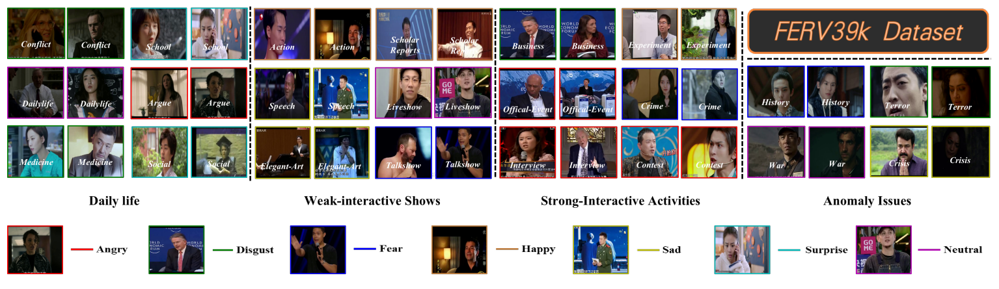

# FERV39k: A Large-Scale Multi-Scene Dataset for Facial Expression Recognition in Videos (Not open yet)

### [Project Page](https://wangyanckxx.github.io/Proj_CVPR2022_FERV39k.html) | [Videos](#) | [Paper](https://arxiv.org/abs/2203.09463)

[FERV39k: A Large-Scale Multi-Scene Dataset for Facial Expression Recognition in Videos](https://arxiv.org/abs/2203.09463) <br>
 [Yan Wang](https://wangyanckxx.github.io/) <sup>1</sup>,
 [Yixuan Sun](http://www.fudanroilab.com/2019/10/07/YixuanSun.html) <sup>1</sup>,
 [Yiwen Huang](#) <sup>2</sup>,
 [Zhongying Liu](http://www.fudanroilab.com/2019/01/17/ZhongyingLiu.html) <sup>2</sup>,
 [Shuyong Gao](http://www.fudanroilab.com/2020/07/01/ShuyongGao.html) <sup>2</sup>,
 [Wei Zhang](https://faculty.fudan.edu.cn/zhangwei1234/zh_CN/jsxx/161831/jsxx/jsxx.htm) <sup>2</sup> <br>,
 [Weifeng Ge](http://www.weifengge.net/) <sup>2</sup>,
 [Wenqiang Zhang](http://faet.fudan.edu.cn/17/bb/c13532a137147/page.htm) <sup>1, 2</sup>

<sup>1</sup> Academy for Engineering & Technology, Fudan University
<sup>2</sup> School of Computer Science, Fudan University <br>




## News!

- 03/2022: The Paper [FERV39k: A Large-Scale Multi-Scene Dataset for Facial Expression Recognition in Videos](https://arxiv.org/abs/2203.09463) is accepted by CVPR 2022.

- 03/2022: Notice!

  ```
  Letter to researchers:
      Since the arxiv version of our CVPR paper is available, we are glad to receive several 
  application emails of FERV39K. However, our work especially the dataset is still 
  under the check of the CVPR conference and the formal version of paper is not published. As a 
  result, the dataset will not be available until the main conference of CVPR2022 is held. 
  During this time, we will gradually make the project webpage, 
  the baseline project and the FERV39K shortcut publicly available.
    																																			                   
                                                Group FERV39K
  ```

  

<!-- ## Model Zoo

<center>

| Model          | Backbone | Pre-trained | Fine-tuned | WAR/UAR     | Trained-model                                                | Val-Results                                                  | # of Parameters |
| -------------- | -------- | ----------- | ---------- | ----------- | ------------------------------------------------------------ | ------------------------------------------------------------ | --------------- |
| ResNet18       | ResNet18 | -           | -          | 39.33/30.30 | [FERV39k-train-ResNet18](#) | [FERV39k-val-ResNet18](#) | 17M             |
| ResNet50       | ResNet50 | -           | -          | 30.57/22.47 | [FERV39k-train-ResNet50](#) | [FERV39k-val-ResNet50](#) | 124M            |
| VGG13          | VGG13    | -           | -          | 41.02/31.19 | [FERV39k-train-VGG13](#) | [FERV39k-val-VGG13](#) | 128M            |
| VGG16          | VGG16    | -           | -          | 41.66/32.01 | [FERV39k-train-VGG16](#) | [FERV39k-val-VGG16](#) | 134M            |
| R18-LSTM       | ResNet18 | -           | -          | 42.59/30.92 | [FERV39k-train-R18-LSTM](#) | [FERV39k-val-R18-LSTM](#) | 132M            |
| R50-LSTM       | ResNet50 | -           | -          | 40.75/32.12 | [FERV39k-train-R50-LSTM](#) | [FERV39k-val-R50-LSTM](#) | 57M             |
| VGG13-LSTM     | VGG13    | -           | -          | 43.37/32.41 | [FERV39k-train-VGG13-LSTM](#) | [FERV39k-val-VGG13-LSTM](#) | 133M            |
| VGG16-LSTM     | VGG16    | -           | -          | 41.70/30.93 | [FERV39k-train-VGG16-LSTM](#) | [FERV39k-val-VGG16-LSTM](#) | 138M            |
| C3D            | C3D      | -           | -          | 31.69/22.68 | [FERV39k-train-C3D](#) | [FERV39k-val-C3D](#) | 78M             |
| I3D            | I3D      | -           | -          | 38.78/30.17 | [FERV39k-train-I3D](#) | [FERV39k-val-I3D](#) | 12M             |
| 3D-R18         | ResNet18 | -           | -          | 37.57/26.67 | [FERV39k-train-3D-R18](#) | [FERV39k-val-3D-R18](#) | 33M             |
| Two C3D        | C3D      | -           | -          | 41.77/30.72 | [FERV39k-train-Two-C3D](#) | [FERV39k-val-Two-C3D](#) | 97M             |
| Two I3D        | I3D      | -           | -          | 41.30/31.01 | [FERV39k-train-Two-I3D](#) | [FERV39k-val-Two-I3D](#) | 26M             |
| Two 3D-R18     | ResNet18 | -           | -          | 42.28/30.55 | [FERV39k-train-Two-3D-R18](#) | [FERV39k-val-Two-3D-R18](#) | 67M             |
| Two R18-LSTM   | ResNet18 | -           | -          | 43.20/31.28 | [FERV39k-train-Two-R18-LSTM](#) | [FERV39k-val-Two-R18-LSTM](#) | 27M             |
| Two VGG13-LSTM | VGG13    | -           | -          | 44.54/32.79 | [FERV39k-train-Two-VGG13-LSTM](#) | [FERV39k-val-Two-VGG13-LSTM](#) | 144M            |
| RS18-LSTM      | ResNet18 | MS-Celeb-1M | FERV39k    | 41.XX/31.XX | [FERV39k-train-R18-LSTM-MS-Celeb-1M](#) | [FERV39k-val-LSTM-MS-Celeb-1M](#) | 132M            |
| RS18-LSTM      | ResNet18 | DFEW        | FERV39k    | 41.XX/29.XX | [FERV39k-train-R18-LSTM-DFEW](#) | [FERV39k-val-LSTM-DFEW](#) | 132M            |
| RS50-LSTM      | ResNet50 | MS-Celeb-1M | FERV39k    | 46.XX/34.XX | [FERV39k-train-R50-LSTM-MS-Celeb-1M](#) | [FERV39k-val-LSTM-MS-Celeb-1M](#) | 57M             |
| RS50-LSTM      | ResNet50 | DFEW        | FERV39k    | 41.XX/29.XX | [FERV39k-train-R50-LSTM-DFEW](#) | [FERV39k-val-LSTM-DFEW](#) | 57M             |
 -->

## Terms & Conditions
- I have known that the dataset will not available until the main conference of CVPR2022
- The dataset is available for non-commercial research purposes only.
- All images of the dataset are obtained from the Internet and some papers which are not property of fudanroilab, Fudan University. The fudanroilab is not responsible for the content nor the meaning of these images.
- You agree not to reproduce, duplicate, copy, sell, trade, resell or exploit for any commercial purposes, any portion of the images and any portion of derived data.
- You agree not to further copy, publish or distribute any portion of the fudanroilab. Except, for internal use at a single site within the same organization it is allowed to make copies of the dataset.
- The SOL reserves the right to terminate your access to the fudanroilab at any time.

## How to get the Password (**<u>Dataset applications will be available after main conference of CVPR2022</u>**)

This dataset is publicly available. It is free for professors and researcher scientists affiliated to a University.
1. Baidu Drive:
* (FERV39k) Download Link(链接): https://pan.baidu.com/s/1TYu41txbDUt-WJzwWc7EPQ  
* Extract Code(提取码)： xxxx **(available after main conference of CVPR2022)**
2. Google Drive:
* Download Link (FERV39k) : **************  **(available after main conference of CVPR2022)**

Permission to use but not reproduce or distribute our database is granted to all researchers given that the following steps are properly followed:
Send an e-mail to Yan Wang (yanwang19@fudan.edu.cn) or Yixuan Sun (21210860014@m.fudan.edu.cn) before downloading the database. You will need a password to access the files of this database. Your Email MUST be set from a valid University account and MUST include the following text:
```
1. Subject: (fudanroilab) Application to download the FERV39k Dataset          
2. Name: <your first and last name>
3. Affiliation: <University where you work>
4. Department: <your department>
5. Position: <your job title>
6. Email: <must be the email at the above mentioned institution>

I have read and agree to the terms and conditions specified in the FERV39K database webpage. 
This database will only be used for research purposes. 
I will not make any part of this database available to a third party. 
I'll not sell any part of this database or make any profit from its use.
```

 

## Citation

```
@inproceedings{wang2022ferv39k,
title={FERV39k: A Large-Scale Multi-Scene Dataset for Facial Expression Recognition in Videos},
author={Yan Wang, Yixuan Sun, Yiwen Huang, Zhongying Liu, Shuyong Gao, Wei Zhang, Weifeng Ge, Wenqiang Zhang},
booktitle={IEEE Conference on Computer Vision and Pattern Recognition (CVPR)},
year={2022}
}
```
